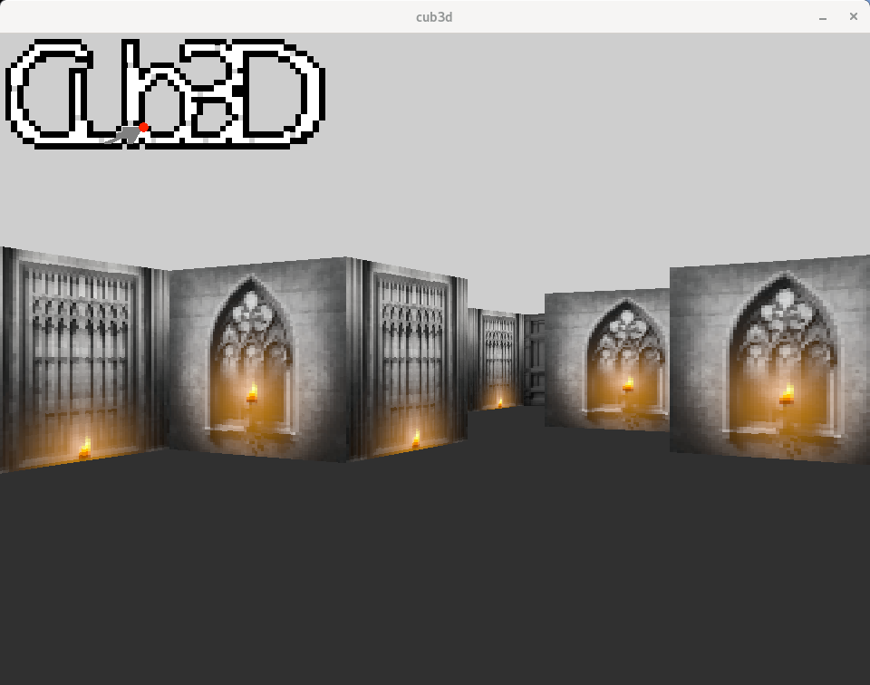

# cub3D - École 42 | Paris

<div align="center">
  
  
  
</div>

<div align="center">
  
</div>

##
<div align="center">
  
</div>

## Description

Le projet **`cub3D`** vise à recréer une expérience inspirée de *`Wolfenstein 3D`*, l’un des premiers `FPS`, en utilisant des techniques de **`ray-casting`** pour générer une vue en `3D` à partir d'une carte `2D`.

L’objectif est de comprendre les bases de la représentation graphique `3D`, tout en respectant les standards de codage et les contraintes imposées par **l’École `42`**.

## Objectifs

- Implémenter un moteur graphique minimal basé sur le **`ray-casting`**.
- Permettre le déplacement du joueur et l’interaction avec un environnement `3D`.
- Charger et valider des cartes personnalisées en format `.cub`.
- Assurer une gestion des erreurs robuste (fichiers, textures, cartes, etc.).
- Respecter la norme graphique **`MinilibX`** et les contraintes liées aux fonctions autorisées.

## Fonctionnalités

- **Moteur `3D` basique** : Affichage d’un environnement `3D` interactif à partir d’une carte `2D`.
- **Validation des cartes** : Vérification stricte des fichiers `.cub` pour éviter les erreurs au chargement.
- **Textures et couleurs** : Support des textures en `.xpm` pour les murs et des couleurs pour le sol et le plafond.
- **Interactions utilisateur** : Déplacements du joueur, orientation de la caméra, et interaction avec l’environnement.
- **Minimap** : Affichage en temps réel d'une carte simplifiée en `2D`.
- **Version bonus** : Ajout de fonctionnalités avancées, telles que les portes interactives ou des labyrinthes complexes.

## Structure du Projet

```bash
raveriss@raveriss-NLx0MU:~$ tree
.
├── Include
│   └── cub3d.h
├── Lib
│   ├── includes
│   │   ├── ft_printf.h
│   │   ├── get_next_line.h
│   │   └── lib.h
│   ├── lib42.a
│   ├── Makefile
│   └── Src
│       ├── ft_atoi.c
│       ├── ft_is_alpha.c
│       ├── ft_len_nb.c
│       ├── ft_len_nb_hexa.c
│       ├── ft_memset.c
│       ├── ft_pointeur.c
│       ├── ft_printf.c
│       ├── ft_putchar.c
│       ├── ft_putnbr_base.c
│       ├── ft_putnbr_base_hex.c
│       ├── ft_putnbr_base_neg.c
│       ├── ft_putstr.c
│       ├── ft_split.c
│       ├── ft_strncmp.c
│       ├── ft_strstr.c
│       ├── get_next_line.c
│       └── get_next_line_utils.c
├── Makefile
├── maps
│   ├── bad
│   │   ├── color_invalid_rgb.cub
│   │   ├── color_missing_ceiling_rgb.cub
│   │   ├── color_missing.cub
│   │   ├── color_missing_floor_rgb.cub
│   │   ├── color_none.cub
│   │   ├── empty.cub
│   │   ├── file_letter_end.cub
│   │   ├── filetype_missing
│   │   ├── filetype_wrong.buc
│   │   ├── map_first.cub
│   │   ├── map_middle.cub
│   │   ├── map_missing.cub
│   │   ├── map_only.cub
│   │   ├── player_multiple.cub
│   │   ├── player_none.cub
│   │   ├── player_on_edge.cub
│   │   ├── test_map_hole.cub
│   │   ├── textures_dir.cub
│   │   ├── textures_duplicates.cub
│   │   ├── textures_forbidden.cub
│   │   ├── textures_invalid.cub
│   │   ├── textures_missing.cub
│   │   ├── textures_none.cub
│   │   ├── textures_not_xpm.cub
│   │   ├── wall_hole_east.cub
│   │   ├── wall_hole_north.cub
│   │   ├── wall_hole_south.cub
│   │   ├── wall_hole_west.cub
│   │   └── wall_none.cub
│   └── good
│       ├── bonus
│       │   ├── cheese_maze.cub
│       │   ├── cub3d.cub
│       │   ├── library.cub
│       │   ├── map_raf_bonus.cub
│       │   ├── space_ship.cub
│       │   ├── subject_map.cub
│       │   └── test_map.cub
│       └── mendatori
│           ├── creepy.cub
│           ├── dungeon.cub
│           ├── map_raf.cub
│           ├── maptest.cub
│           ├── map_too_small.cub
│           ├── matrix.cub
│           ├── sad_face.cub
│           ├── square_map.cub
│           ├── test.cub
│           ├── test_pos_bottom.cub
│           ├── test_pos_left.cub
│           ├── test_pos_right.cub
│           ├── test_pos_top.cub
│           ├── test_textures.cub
│           ├── test_whitespace.cub
│           └── works.cub
├── README.md
├── screenshot.png
├── srcs
│   ├── draw
│   │   ├── dda.c
│   │   ├── dda_utils.c
│   │   ├── game.c
│   │   ├── minimap.c
│   │   ├── player.c
│   │   ├── skyground.c
│   │   └── wall.c
│   ├── free
│   │   ├── free.c
│   │   └── garcol.c
│   ├── get
│   │   ├── check_images_exist.c
│   │   ├── elem2.c
│   │   ├── elem.c
│   │   ├── input.c
│   │   ├── map.c
│   │   └── player.c
│   ├── key
│   │   ├── key1.c
│   │   └── key2.c
│   ├── main.c
│   ├── mlx
│   │   └── mlx.c
│   ├── parse
│   │   └── parse.c
│   └── utils
│       ├── utils2.c
│       └── utils.c
├── srcs_bonus
│   ├── draw
│   │   ├── dda.c
│   │   ├── dda_utils.c
│   │   ├── fix_fisheye.c
│   │   ├── game.c
│   │   ├── game_init.c
│   │   ├── load_texture.c
│   │   ├── minimap.c
│   │   ├── player.c
│   │   ├── ray_utils.c
│   │   ├── skyground.c
│   │   └── wall.c
│   ├── free
│   │   ├── free.c
│   │   └── garcol.c
│   ├── get
│   │   ├── check_images_exist.c
│   │   ├── elem2.c
│   │   ├── elem.c
│   │   ├── input.c
│   │   ├── map.c
│   │   └── player.c
│   ├── key
│   │   ├── key1.c
│   │   ├── key2.c
│   │   └── mouse_event.c
│   ├── main.c
│   ├── mlx
│   │   └── mlx.c
│   ├── parse
│   │   └── parse.c
│   └── utils
│       ├── utils2.c
│       └── utils.c
└── textures
    ├── east_10.xpm
    ├── east_11.xpm
    ├── east_12.xpm
    ├── east_1.xpm
    ├── east_2.xpm
    ├── east_3.xpm
    ├── east_4.xpm
    ├── east_5.xpm
    ├── east_6.xpm
    ├── east_7.xpm
    ├── east_8.xpm
    ├── east_9.xpm
    ├── east.xpm
    ├── north_10.xpm
    ├── north_11.xpm
    ├── north_12.xpm
    ├── north_1.xpm
    ├── north_2.xpm
    ├── north_3.xpm
    ├── north_4.xpm
    ├── north_5.xpm
    ├── north_6.xpm
    ├── north_7.xpm
    ├── north_8.xpm
    ├── north_9.xpm
    ├── north.xpm
    ├── porte.xpm
    ├── south_10.xpm
    ├── south_11.xpm
    ├── south_12.xpm
    ├── south_1.xpm
    ├── south_2.xpm
    ├── south_3.xpm
    ├── south_4.xpm
    ├── south_5.xpm
    ├── south_6.xpm
    ├── south_7.xpm
    ├── south_8.xpm
    ├── south_9.xpm
    ├── south.xpm
    ├── west_10.xpm
    ├── west_11.xpm
    ├── west_12.xpm
    ├── west_1.xpm
    ├── west_2.xpm
    ├── west_3.xpm
    ├── west_4.xpm
    ├── west_5.xpm
    ├── west_6.xpm
    ├── west_7.xpm
    ├── west_8.xpm
    ├── west_9.xpm
    └── west.xpm
```
## Compilation
Utilisez le `Makefile` pour compiler le projet avec les options de compilation requises. 
Le projet utilise les flags `-Wall` `-Wextra` `-Werror`.

Commandes disponibles :

```bash

make        # Compile le projet
make clean  # Supprime les fichiers objets
make fclean # Supprime les fichiers objets et binaires
make re     # Recompile le projet
make bonus  # Compile la version bonus du projet
```

## Lancer le jeu
```bash
./cub3D <path_to_map.cub>
```
Arguments :
<path_to_map.cub> : Chemin vers une carte valide au format .cub.
Exemple :
```bash
./cub3D maps/good/mendatori/matrix.cub
```
## Aperçu
<div align="center">  </div>

## Tester le projet
Pour valider votre implémentation :

Cartes valides : Testez avec les cartes du dossier `maps/good/` pour vérifier le bon fonctionnement du jeu.
Cartes invalides : Utilisez les cartes du dossier `maps/bad/` pour tester la robustesse de la validation des entrées.

## Controls

| Key / Input    | Action                       |
|----------------|------------------------------|
| `W`            | Move forward                |
| `S`            | Move backward               |
| `A`            | Strafe left                 |
| `D`            | Strafe right                |
| Left Arrow     | Rotate left                 |
| Right Arrow    | Rotate right                |
| Mouse          | Rotate by moving the mouse (bonus only) |

## Débogage et Diagnostic
Vérification des erreurs de segmentation :
```bash
valgrind ./cub3D <path_to_map.cub>
```
## Tests des textures et gestion des erreurs

### Gestion des textures manquantes ou invalides :
- **Chemin inexistant** : Vérifiez que le programme détecte et signale les chemins de fichiers invalides.
- **Chemin pointant vers un dossier** : Assurez-vous que le programme distingue un fichier `.xpm` valide d’un dossier portant le même nom.
- **Fichier `.xpm` vide** : Testez que le programme détecte et signale les fichiers `.xpm` vides ou corrompus.

### Gestion des erreurs de carte :
- Modifiez une carte (trous dans les murs, coordonnées du joueur manquantes, etc.) pour vérifier la robustesse de la détection des erreurs.

## Fonctionnalités Bonus
- Support des portes interactives.
- Labyrinthes avec des textures dynamiques.
- Détection et correction de l’effet de `fisheye` pour un rendu réaliste.
## Contributeurs

- [lgoure](https://github.com/lukas94kdl)
- [raveriss](https://github.com/raveriss) 

## Ressources Utilisées

- [Tutoriel Raycasting Partie 1 : Introduction et concepts de base](https://www.youtube.com/watch?v=gYRrGTC7GtA&ab_channel=3DSage)
- [Tutoriel Raycasting Partie 2 : Implémentation en C](https://www.youtube.com/watch?v=fRu8kjXvkdY&ab_channel=3DSage)
- [Tutoriel Raycasting Partie 3 : Ajout des textures et optimisation](https://www.youtube.com/watch?v=w0Bm4IA-Ii8&ab_channel=3DSage)
- [Tutoriel Raycasting Partie 4 : Gestion des sprites et des objets](https://www.youtube.com/watch?v=8j0gakEHJuI&ab_channel=3DSage)
- [Documentation de la MiniLibX](https://harm-smits.github.io/42docs/libs/minilibx)
- [Dépôt GitHub de la MiniLibX pour Linux](https://github.com/42Paris/minilibx-linux)
- [Guide Raycasting by Lode Vandevenne](https://lodev.org/cgtutor/raycasting.html)
- [Wiki Raycanting](https://en.wikipedia.org/wiki/Ray_casting#Beyond_raycasting)
- [12 Principles of Animation - Alan Becker](https://www.youtube.com/watch?v=uDqjIdI4bF4&ab_channel=AlanBeckerTutorials)
